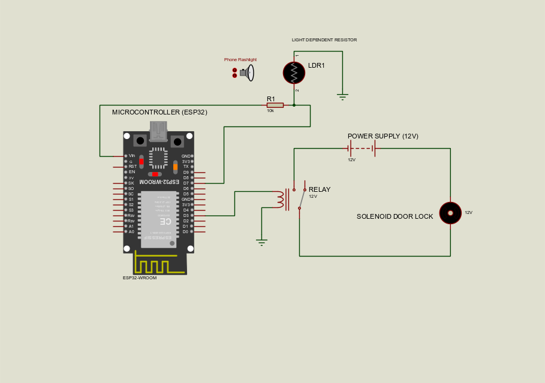
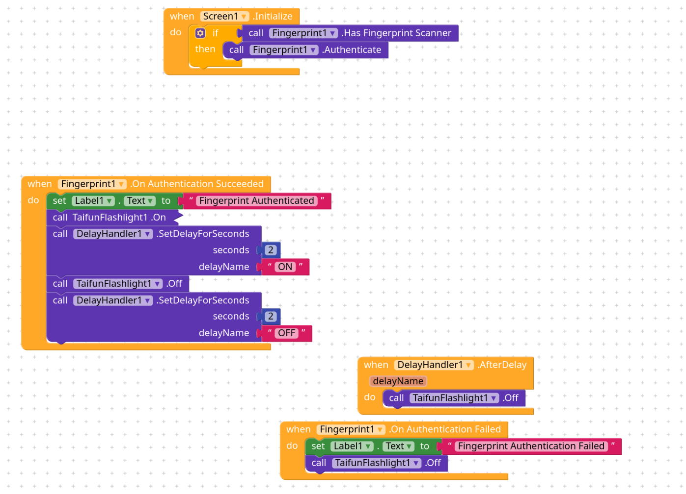

# Smart Door Lock Using Li-Fi 

This repo tracks the project "Smart Door Lock using Li-Fi"

## Components Used

1. ESP32 
2. Solenoid Door Lock
3. Adafruit Neopixel LED Array
4. LDR (Light Dependent Resistor)
5. Relay (5V)

## Software used

1. Arduino CLI
2. Proteus (Simulation)
3. Kodular (Block based mobile app builder)
4. Git (Version Control)
5. Codeberg (Code Hosting)

## Circuit Diagram

## Mobile app blocks

